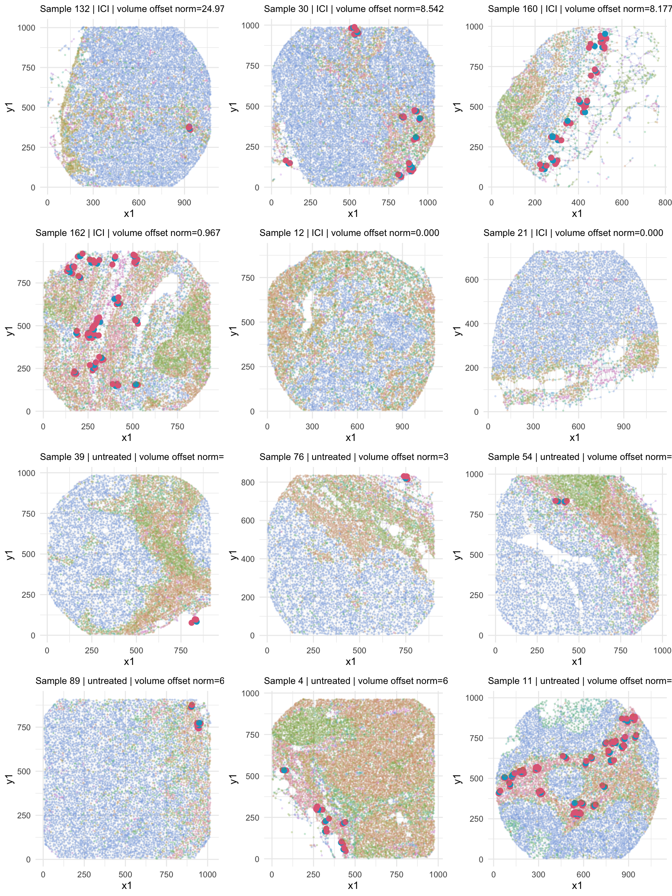
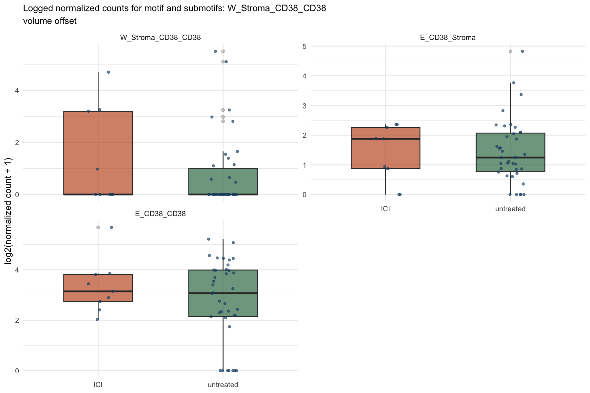

``` r
knitr::opts_chunk$set(
  message = FALSE,
  warning = FALSE,
  echo = FALSE,
  fig.width = 12,
  fig.height = 15,
  dpi = 150
)

repo_candidates <- unique(normalizePath(c(
  getwd(),
  file.path(getwd(), ".."),
  file.path(getwd(), "..", ".."),
  file.path(getwd(), "..", "..", "..")
), mustWork = FALSE))
repo_hit <- vapply(repo_candidates, function(path) {
  desc <- file.path(path, "DESCRIPTION")
  file.exists(desc) && any(grepl("^Package: CellEdgeR$", readLines(desc)))
}, logical(1))
root_dir <- if (any(repo_hit)) repo_candidates[which(repo_hit)[1]] else NA_character_
use_local <- !is.na(root_dir)

local_rlib <- if (use_local) file.path(root_dir, ".Rlib") else ".Rlib"
if (dir.exists(local_rlib)) {
  .libPaths(c(normalizePath(local_rlib), .libPaths()))
}

report_dir <- if (use_local) {
  file.path(root_dir, "analysis", "hochchulz_2022_melanoma")
} else {
  normalizePath(getwd(), mustWork = FALSE)
}
```

## Summary

- Contrast cache: hochschulz_base.rds using
  patient_treatment_group_before_surgery.
- Available samples in cache: ICI = 9, untreated = 38.
- Normalization view: volume offset.
- Selected motifs: top 1 tested wedge/triangle motifs by nominal
  `PValue`.
- Per motif, selection rule: top 6 `ICI` samples and top 6 `untreated`
  samples by volume-normalized motif abundance.
- Boxplots show `log2(normalized count + 1)`.
- Low-count motifs filtered by `edgeR::filterByExpr()` are not eligible
  for this nominal-p-value selection.

| selection_rank | resolved_motif     | motif_layer | logFC    | PValue    | FDR       | edgeR_test_status |
|:---------------|:-------------------|:------------|:---------|:----------|:----------|:------------------|
| 1              | W_Stroma_CD38_CD38 | wedge       | 2.258151 | 0.0011496 | 0.3554035 | tested            |

| motif              | offset_mode | normalization | sample | group     | rank_within_group | normalized_count |
|:-------------------|:------------|:--------------|:-------|:----------|:------------------|:-----------------|
| W_Stroma_CD38_CD38 | volume      | volume offset | 132    | ICI       | 1                 | 24.9745          |
| W_Stroma_CD38_CD38 | volume      | volume offset | 30     | ICI       | 2                 | 8.5424           |
| W_Stroma_CD38_CD38 | volume      | volume offset | 160    | ICI       | 3                 | 8.1774           |
| W_Stroma_CD38_CD38 | volume      | volume offset | 162    | ICI       | 4                 | 0.9670           |
| W_Stroma_CD38_CD38 | volume      | volume offset | 12     | ICI       | 5                 | 0.0000           |
| W_Stroma_CD38_CD38 | volume      | volume offset | 21     | ICI       | 6                 | 0.0000           |
| W_Stroma_CD38_CD38 | volume      | volume offset | 39     | untreated | 1                 | 44.2343          |
| W_Stroma_CD38_CD38 | volume      | volume offset | 76     | untreated | 2                 | 33.3618          |
| W_Stroma_CD38_CD38 | volume      | volume offset | 54     | untreated | 3                 | 8.4797           |
| W_Stroma_CD38_CD38 | volume      | volume offset | 89     | untreated | 4                 | 6.8810           |
| W_Stroma_CD38_CD38 | volume      | volume offset | 4      | untreated | 5                 | 6.0279           |
| W_Stroma_CD38_CD38 | volume      | volume offset | 11     | untreated | 6                 | 2.1484           |

## W_Stroma_CD38_CD38

- Nominal PValue rank: `1`
- Layer: `wedge`
- logFC: `2.258`
- Nominal PValue: `0.00115`
- FDR: `0.3554`
- edgeR test status: `tested`
- Selection: highest volume-normalized motif abundance within each
  group.

### volume offset

| offset_mode | normalization | sample | group     | rank_within_group | normalized_count |
|:------------|:--------------|:-------|:----------|:------------------|:-----------------|
| volume      | volume offset | 132    | ICI       | 1                 | 24.9745          |
| volume      | volume offset | 30     | ICI       | 2                 | 8.5424           |
| volume      | volume offset | 160    | ICI       | 3                 | 8.1774           |
| volume      | volume offset | 162    | ICI       | 4                 | 0.9670           |
| volume      | volume offset | 12     | ICI       | 5                 | 0.0000           |
| volume      | volume offset | 21     | ICI       | 6                 | 0.0000           |
| volume      | volume offset | 39     | untreated | 1                 | 44.2343          |
| volume      | volume offset | 76     | untreated | 2                 | 33.3618          |
| volume      | volume offset | 54     | untreated | 3                 | 8.4797           |
| volume      | volume offset | 89     | untreated | 4                 | 6.8810           |
| volume      | volume offset | 4      | untreated | 5                 | 6.0279           |
| volume      | volume offset | 11     | untreated | 6                 | 2.1484           |

Spatial motif plots selected by volume offset normalized abundance:



Logged normalized motif and submotif boxplots:


